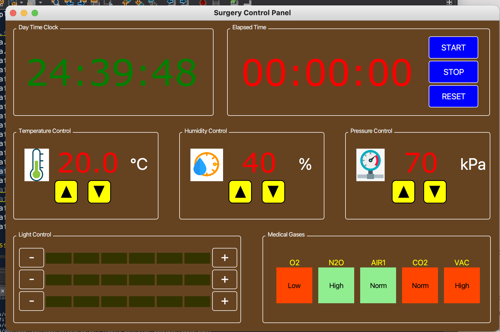
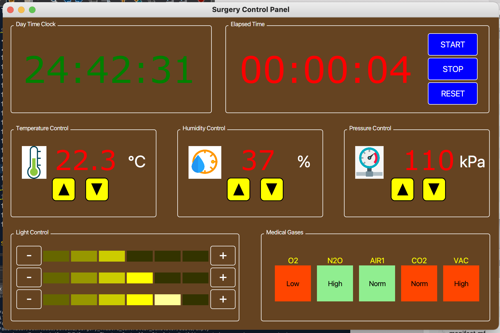

# Surgery-Theatre-Controller-Simulator
**Object Oriented Programming Coursework, Second Year of Computer Science**

Task is a JavaFX Graphical User Interface (GUI), with a focus on layout and event handling. It is **not** created using a visual drag-and-drop tool, and **not** an FXML program,
 
1. The application comprises several regions representing controls for clocks (a real time and an elapsed time), room temperature, humidity and pressure, lighting control, and a medical gases display. Each area on screen comprises JavaFX nodes and controls, such as buttons, labels, text, image views and graphical shapes.

- &emsp; Below is the final result.
  
  &emsp;&emsp; 

- &emsp; Next, here is what the interface looks like after user interaction.
  
  &emsp;&emsp; 
